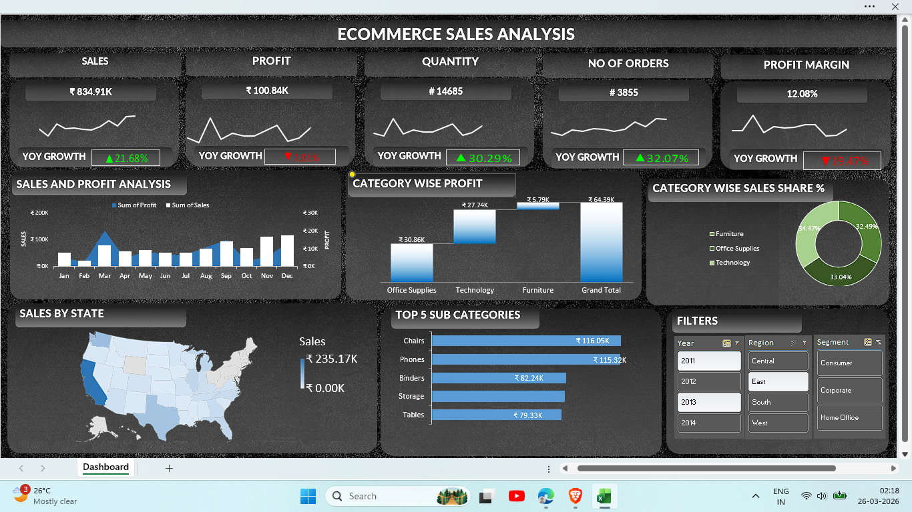

# 📊 E-Commerce Sales Dashboard (Excel)

## 🧾 Overview

Developed an interactive Excel dashboard to analyze e-commerce sales performance across regions, categories, and time periods. The dashboard includes KPI tracking, YoY growth analysis, and regional insights, enabling clear visualization of key trends and supporting data-driven decision-making.

---

## 🎯 Objectives

* Analyze overall sales and profit performance
* Track year-over-year (YoY) growth
* Identify trends across time periods
* Compare performance across regions and categories
* Evaluate profit margins and order distribution

---

## 📌 Key Metrics

* **Total Sales**
* **Total Profit**
* **Total Quantity Sold**
* **Number of Orders**
* **Profit Margin (%)**
* **YoY Growth (Sales & Profit)**

---

## 📊 Dashboard Features

* Interactive filters (Year, Region, Segment)
* KPI cards for quick performance overview
* Monthly sales and profit trend analysis
* Category and sub-category performance comparison
* Regional performance visualization
* Structured and user-friendly layout

---

## 📈 Key Insights

* Identified top-performing categories based on sales and profit
* Observed sales and profit trends over time
* Compared regional performance across different segments
* Analyzed variation in profit margins across categories

---

## 🛠️ Tools & Techniques Used

* Microsoft Excel
* Pivot Tables
* Charts (Bar, Line, Donut, Waterfall)
* Slicers for interactivity
* Data cleaning and transformation

---

## 🖼️ Dashboard Preview

---

## 🎥 Demo Video

[Click here to watch the dashboard demo](Dashboard-Demo.mp4)

---

## 📂 Project Files

* `Ecommerce Sales Analysis..xlsx` – Main Excel workbook
* `Final_Dashboard.png` – Dashboard preview image
* `Dashboard-Demo.mp4` – Short demo video

---

## 🚀 Conclusion

This project demonstrates the use of Excel for data analysis and visualization by transforming raw data into meaningful insights through an interactive dashboard.

---

